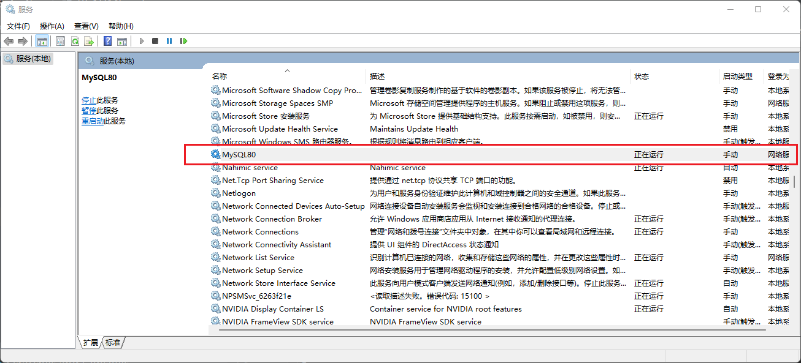
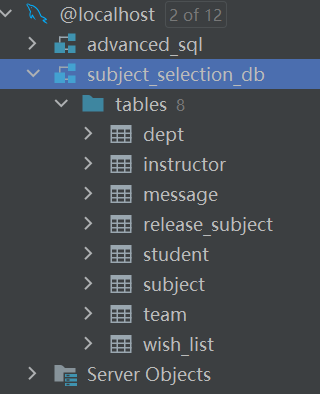
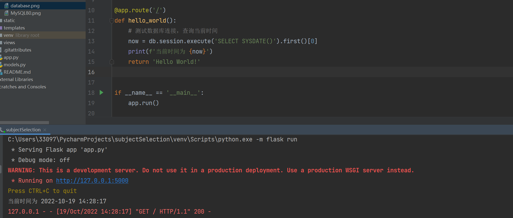

# subjectSelection
 工程实践选题系统

## 项目文档  
[点击查看项目文档](https://note.youdao.com/s/Z4NKGtb9)

前端html文件存放在**templates**目录下

css文件、图片等资源存放在**static**目录下

## 项目配置
1. 使用git克隆项目到本地
2. 在本地主机上运行mysql服务  
搜索->服务->MySQL80

3. 使用Mysql Bench/Navicat/Pycharm内置数据库插件，运行项目文件下的**database->SubjectSelectionSys4.sql**，
该文件会在MySQL服务器上建立数据库实例**subject_selection_db**以及对应的关系数据库表

4. 运行**database->AccountData.sql**，导入学生和导师的用户信息。
4. 在项目文件下的**com->config**内，修改为你的数据库用户密码
5. 运行app.py，点击链接测试数据库是否正常运行

